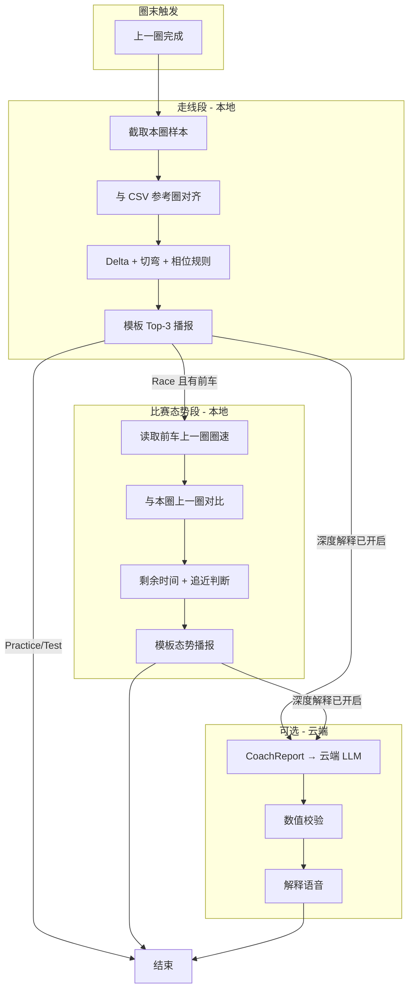

# iRacing 圈末实时语音教练 — Requirements

## Summary

Windows 本地常驻的 iRacing 圈末语音教练：每圈结束自动对比上一圈与一条外部 CSV 目标参考圈（视为最佳走线），规则引擎输出逐弯损失与改进建议并本地语音播报；多人比赛时在走线总结之后，追加与前车上一圈的圈速对比及基于剩余比赛时间的追近判断。走线计算与语音合成全程本地、无 GPU；云端 LLM 仅作可选解释层，失败时回退模板话术。

## Problem Frame

iRacing 内置 delta 只显示总圈差，MoTeC/VRS 需切出游戏看图，现有云教练（trophi.ai、PoleCraft 等）依赖订阅且黑盒。练习时车手需要：**不中断心流**、**知道损失在哪个弯**、**听到可执行的改法**；比赛时还需要在走线反馈之外，快速知道与前车的 pace 关系和是否仍有追近窗口。现有工具要么只做图表、要么只做 spotter，缺少「圈末走线教练 + 比赛态势」的一体化本地语音体验。

---

## Key Decisions

- **圈末双段播报，非赛中连续 whisper** — 走线总结与比赛态势均在圈间窗口完成，避免入弯认知过载。
- **目标参考圈 = 用户加载的外部 CSV** — 视为最佳走线；v1 不以会话 PB 替代 CSV，避免与「向 pro 学习」目标混淆。
- **走线归因 = 规则引擎 + 相位模板** — delta 与 pattern 由确定性算法产生；LLM 不参与数值计算。
- **云端 LLM = 可选解释层** — 默认走线播报用模板；用户开启深度解释或追问「为什么」时异步调云端；失败或无网络时静默回退模板，不阻塞播报。
- **对手能力 = 实时圈速态势，非对手走线逐弯** — v1 仅对比「前车上一圈 vs 我的上一圈」及剩余比赛时间，估算追近机会；不读取对手 brake/throttle 通道（SDK 不提供）。
- **追踪对手 = 正前方一位** — 以 `CarIdxPosition` 确定直接前车；无前车时跳过对手段。
- **本地优先、零 GPU** — 赛中与圈末核心路径不依赖 GPU 或本地大模型，避免影响游戏性能。

---

## Actors

- **A1. 车手** — 在 iRacing 练习或比赛中驾驶；接收圈末语音反馈；可选开启云端解释或追问。
- **A2. 教练系统（本地）** — 读取 SDK 遥测、执行 delta 与规则、生成播报队列、驱动 TTS；管理参考圈 CSV 与配置。
- **A3. 云端 LLM 服务（可选）** — 接收结构化 CoachReport JSON，返回自然语言解释；不可用时不影响 A2 核心播报。

---

## Requirements

**遥测与参考圈**

- R1. 教练系统通过 iRacing 共享内存 API 以约 60Hz 读取本车遥测，并在每圈结束时自动截取完整上一圈样本序列。
- R2. 系统支持加载一条外部 CSV 作为目标参考圈；首次加载时自动推断列映射（至少含距离进度、速度、刹车、油门），圈长与当前赛道不匹配时拒判并语音提示错误原因。
- R3. 参考圈与上一圈按距离进度轴对齐后，计算 rolling delta 及逐弯时差；数值结果可序列化为结构化 CoachReport，供规则层与可选 LLM 共用。

**走线分析与播报**

- R4. 系统按刹车/G 信号自动切分弯道，并在每弯内识别 brake / apex / exit 相位损失；匹配已知 pattern（如早刹、晚开油、弯心走外）并映射为 advice_key。
- R5. 每圈走线播报采用稀疏策略：总圈差 + 最多 3 个主要损失弯 + 1 条下圈优先改进建议；走线段语音总长不超过约 20 秒。
- R6. 走线播报文案由规则模板生成；播报中的秒数与 CoachReport 中数值必须一致，不允许 LLM 改写 delta 数字。

**比赛态势（前车圈速）**

- R7. 当会话类型为 Race 且存在直接前车时，系统在走线播报结束后追加比赛态势段。
- R8. 比赛态势段对比「我的上一圈完成圈速」与「前车上一圈完成圈速」，给出圈速差（快/慢多少）及与前车的位置关系。
- R9. 系统结合 SessionTimeRemain（或等效剩余比赛时间）与近期圈速差趋势，输出一句追近判断（例如：按当前 pace 是否有 realistic 追近窗口，或需每圈快 X 秒才可能接触）。
- R10. 比赛态势段总长不超过约 10 秒；无前车、练习/排位会话、或对手数据不可用时，跳过该段且不播报占位内容。

**语音与性能**

- R11. 走线与比赛态势播报均通过本地 TTS 或预录 clip 混音完成；全程不要求 GPU，且不在赛中运行本地大模型推理。
- R12. 从本圈结束到走线播报开始，延迟目标不超过 10 秒（短圈赛道可配置放宽）。

**云端 LLM 解释层**

- R13. 用户可在配置中开启「深度解释」；开启后，走线与比赛态势模板播报完成后，系统可选异步请求云端 LLM，基于 CoachReport 生成 2–3 句「为什么」类补充（不超过约 15 秒语音）。
- R14. 云端 LLM 输入仅为结构化 JSON（含 delta、pattern_id、advice_key、比赛态势摘要）；禁止 LLM 自行计算或修改任何秒数、圈速、位置数值。
- R15. 云端不可用、超时、或输出未通过数值校验时，系统跳过 LLM 段且不向车手报错打断；核心模板播报已完成即视为成功。

---

## Key Flows

- F1. **圈末走线教练**
  - **Trigger:** 本车 `LapCompleted` 递增（上一圈刚完成）。
  - **Actors:** A1, A2
  - **Steps:** 截取上一圈样本 → 与参考 CSV 对齐 → 切弯与相位归因 → 生成 CoachReport → 模板排序 Top-3 → 本地 TTS 播报走线段。
  - **Outcome:** 车手听到本圈相对目标圈的总差与主要改进弯，无需切出游戏。
  - **Covered by:** R1, R3, R4, R5, R6, R11, R12

- F2. **圈末比赛态势（前车）**
  - **Trigger:** F1 走线段播报完成或排队中；会话为 Race；存在直接前车。
  - **Actors:** A1, A2
  - **Steps:** 读取前车与本车 `CarIdxLastLapTime` → 计算圈速差 → 读取剩余比赛时间 → 规则估算追近窗口 → 模板 TTS 播报比赛态势段。
  - **Outcome:** 车手在走线反馈后了解与前车的 pace 关系及是否仍有追近机会。
  - **Covered by:** R7, R8, R9, R10, R11

- F3. **可选云端解释**
  - **Trigger:** 用户已开启深度解释；F1（及 F2 若执行）CoachReport 已生成。
  - **Actors:** A1, A2, A3
  - **Steps:** 异步 POST CoachReport → LLM 返回解释文案 → 数值校验 → 可选 TTS 播报；失败则结束。
  - **Outcome:** 车手获得额外因果解释，不影响已完成的模板播报。
  - **Covered by:** R13, R14, R15

- F4. **参考圈加载与校验**
  - **Trigger:** 用户指定 CSV 路径或更换参考圈。
  - **Actors:** A1, A2
  - **Steps:** Schema-on-read → 圈长/赛道指纹校验 → 绑定为当前目标参考圈。
  - **Outcome:** 后续每圈对比均使用该参考圈；不匹配则拒判。
  - **Covered by:** R2

---

## Acceptance Examples

- AE1. **练习圈末走线播报**
  - **Covers:** R4, R5, R6, R12
  - **Given:** 已加载与当前赛道匹配的参考 CSV；车手刚完成一圈。
  - **When:** 系统检测到圈完成。
  - **Then:** 10 秒内开始播报；内容含总圈差、最多 3 个损失弯及建议；秒数与内部 CoachReport 一致。

- AE2. **参考圈赛道不匹配**
  - **Covers:** R2
  - **Given:** 加载的 CSV 圈长与当前赛道偏差超过阈值。
  - **When:** 圈完成触发对比。
  - **Then:** 不进行 delta 计算；语音提示参考圈不匹配；不输出虚假弯间建议。

- AE3. **比赛中有前车**
  - **Covers:** R7, R8, R9, R10
  - **Given:** Race 会话；车手 P5，直接前车 P4；本圈 1:42.0，前车上一圈 1:41.5；剩余比赛时间 8 分钟。
  - **When:** 走线段播报结束。
  - **Then:** 追加播报圈速慢 0.5 秒及基于剩余时间与 pace 差的一句追近判断；总播报含走线 + 态势不超过约 30 秒。

- AE4. **练习会话无对手段**
  - **Covers:** R10
  - **Given:** 单人 Practice；无有效前车。
  - **When:** 圈完成。
  - **Then:** 仅播报走线段；不出现比赛态势或追及相关内容。

- AE5. **云端 LLM 失败回退**
  - **Covers:** R15
  - **Given:** 用户开启深度解释；网络断开或 API 超时。
  - **When:** F1 模板播报已完成。
  - **Then:** 不播报 LLM 段；不向车手播报错误；会话继续下一圈正常触发 F1。

- AE6. **LLM 输出数值校验失败**
  - **Covers:** R14, R15
  - **Given:** 云端返回文案中弯间 delta 与 CoachReport 不一致。
  - **When:** 校验失败。
  - **Then:** 丢弃 LLM 文案；不播报；模板播报结果不受影响。

---

## Success Criteria

- 车手在练习中连续跑 5 圈，无需 Alt-Tab 或打开 MoTeC，即可复述「下一圈最该改哪一弯」。
- 走线播报 p90 启动延迟 ≤ 10 秒（标准长度赛道）。
- 模板播报中数值与 CoachReport 100% 一致（零 LLM 篡改 delta）。
- Race 会话中，前车存在时 p95 能在走线播报后 15 秒内完成比赛态势段。
- 云端 LLM 关闭或不可用时，核心走线 + 态势功能与开启前行为一致（除无解释段外）。

---

## Scope Boundaries

**Deferred for later**

- Supervision 俯视图 delta 热力叠层（ideation #5）
- 用户手动导入对手 `.ibt`/CSV 做逐弯走线对比
- 会话 PB 自举参考圈（无 CSV 时的零配置模式）
- 赛中 sector whisper（圈内短提示）
- 语音「为什么」的 push-to-talk 交互（v1 可仅配置开关触发）

**Outside this product's identity**

- 替代 Crew Chief spotter/工程师功能
- 自动上传遥测至 Garage 61/VRS
- 需 GPU 的本地大模型推理
- 修改 iRacing 游戏内数据或自动化驾驶

---

## Dependencies / Assumptions

- 车手在 Windows 上运行 iRacing，并已启用遥测（SDK 共享内存可用）。
- 目标参考圈 CSV 由用户自行从 MoTeC 导出、社区工具或自制表格提供；v1 不集成 VRS 专有格式。
- iRacing SDK 对对手仅暴露 `CarIdx*` 汇总数组（圈速、位置、赛道进度等），不暴露对手 onboard 通道；比赛态势基于此前提设计。
- 「直接前车」定义为整体名次上紧邻前方的一辆；同圈被套圈/异常 position 时，追及判断可能不准确（v1 接受启发式误差）。
- 云端 LLM 需用户自行配置 API endpoint 与 key；CoachReport 不含原始身份数据以外的隐私字段。

---

## Outstanding Questions

**Deferred to Planning**

- 自研 SDK 薄封装 vs 引用现有 Go/Python 库的具体选型与模块边界。
- TTS 方案：纯 Piper CLI vs 预录 clip 混音 vs 两者组合。
- 追及判断规则的具体公式（固定「需每圈快 X 秒」 vs 滑动平均 pace 趋势）。
- 参考 CSV 最小列集与单位（mph/kph）自动换算策略。
- 云端 LLM 提供商与默认模型（OpenAI-compatible API 抽象是否足够）。

**Resolve Before Planning（若阻塞架构）**

- 无 — 用户已确认方案 A + 云端解释层 + 前车上一圈圈速对比；上述 deferred 项不阻止 requirements 进入 planning。

---

## Sources / Research

- Prior ideation: `docs/ideation/2026-06-09-iracing-lap-coach-ideation.md`
- iRacing SDK shared memory: `Local\IRSDKMemMapFileName`；对手字段见 pyirsdk `vars.txt`（`CarIdxLastLapTime`, `CarIdxPosition`, `CarIdxLapDistPct`, `SessionTimeRemain`）
- 竞品参考：TrackPro APEX（实时语音）、Full Grip Vision（本地模板 + CPU TTS）、Garage 61 / VRS（图表对比无圈末语音一体）
