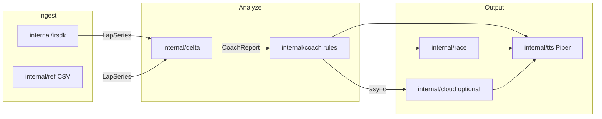

# feat: iRacing 圈末实时语音教练

## Summary

在仓库根目录新建 Go 模块 `iracing-coach/`，实现 Windows 本地常驻二进制：圈末自动对比上一圈与外部 CSV 目标参考圈，规则引擎生成逐弯建议并 CPU TTS 播报；Race 会话追加与前车上一圈的圈速对比及追近判断；可选 OpenAI-compatible 云端 LLM 在模板播报完成后异步解释。全程无 GPU、无本地大模型。

## Problem Frame

见 origin `docs/brainstorms/2026-06-09-iracing-lap-coach-requirements.md`。本计划解决 **HOW**：模块划分、技术选型、实现顺序与验证方式。

---

## Requirements

本计划实现 origin 全部 R1–R15，并按下列规划决策细化未决项。

| ID | 要求（实现后必须为真） |
|----|------------------------|
| R1 | 自研薄 SDK 封装读取 `Local\IRSDKMemMapFileName`，60Hz 采样，圈完成时输出完整上一圈 `LapSeries` |
| R2 | CSV schema-on-read；圈长指纹偏差 >0.5% 拒判并语音提示 |
| R3 | 距离轴对齐 + rolling delta + 可序列化 `CoachReport` |
| R4 | 刹车/G 切弯 + brake/apex/exit 相位 + pattern_id/advice_key |
| R5 | 走线段 Top-3 弯 + 优先建议，≤~20s |
| R6 | 模板播报数值与 CoachReport 一致 |
| R7–R10 | Race + 直接前车时追加态势段；无前车/非 Race 跳过 |
| R11–R12 | Piper CPU TTS；圈末 p90 启动 ≤10s（可配置） |
| R13–R15 | 可选云端解释；JSON 入；失败静默回退 |

---

## Key Technical Decisions

**KTD-1: Go 独立模块 `iracing-coach/`**  
与 Python 实验目录隔离；单 `go.mod`；产出 `iREngineer`。Rationale: 用户目标为本地二进制、低内存常驻；仓库无 Go 先例，独立根目录最清晰（见 repo research）。

**KTD-2: 自研 irsdk 薄封装，不依赖 goirsdk**  
对照 [vipoo/irsdk `irsdk_defines.h`](https://github.com/vipoo/irsdk/blob/master/irsdk_defines.h) 与 pyirsdk 行为实现：`OpenFileMapping`、header/varHeader 解析、buffer 轮转、`GetVar`、session YAML。Rationale: 协议稳定、可控、与 delta 同 repo；只读 live + 可选 `.ibt` 回放留 v1.1。

**KTD-3: 内部统一 `LapSeries` 样本模型**  
通道：`LapDistPct`, `Speed`, `Brake`, `Throttle`, `Steer`, `LatAccel`（及 session 元数据）。SDK 与 CSV 均归一化到此结构。Rationale: delta 引擎与 SDK 解耦，便于 golden-file 测试。

**KTD-4: Delta 纯算法包 `internal/delta`**  
1000 点 `LapDistPct` 网格重采样；rolling delta `∫(1/v_cand - 1/v_ref) ds`；弯道由刹车阈值 + apex（min speed / max |LatAccel|）切分。Rationale: 对齐 FastF1/MoTeC 惯例；LLM 不参与算数（origin 决策）。

**KTD-5: 规则层 `internal/coach` + 模板**  
`pattern_id` → `advice_key` → 中文/英文模板槽位；Top-3 按弯内 delta 排序。走线宽/窄 v1 用 `LatAccel`+`Steer` 相位规则（`wide_apex`, `late_throttle` 等），不做 GPS 横向偏移（deferred）。Rationale: 无 LLM 可交付可执行建议。

**KTD-6: TTS = Piper CLI 子进程 + 模板变量**  
`piper --model <onnx> --output_file` 生成 wav，Windows 默认 API 播放；v1 不做预录 clip 混音（deferred）。Rationale: CPU-only、无 GPU；Full Grip 同类路径。

**KTD-7: 语音队列状态机**  
状态：`Idle → Capturing → Analyzing → SpeakingLine → SpeakingRace → SpeakingLLM`。新圈完成时：若正在 `SpeakingLLM` 则取消 LLM；若正在 `SpeakingLine/Race` 则**打断并清空队列**，仅处理最新一圈（避免错圈反馈）。Rationale: spec-flow 竞态缺口。

**KTD-8: 无效圈跳过**  
以下情况跳过 F1 分析，仅短语音提示原因：`LapLastLapTime <= 0`、样本点数 < 阈值、圈长 < 参考 90%、检测到 pit/stop go（`OnPitRoad` 或 `PlayerCarPosition` 异常持续）。Rationale: 避免 spin/out-lap 虚假弯间建议。

**KTD-9: 前车解析**  
`PlayerCarPosition = P`；扫描 `CarIdxPosition == P-1` 得 `carIdx`；若不存在或 `CarIdxLastLapTime <= 0`（pit/首圈）则跳过 F2。Rationale: origin「直接前车」；v1 接受套圈/heuristic 误差。

**KTD-10: 追及判断启发式**  
`pace_delta = my_last_lap - ahead_last_lap`（正=我慢）。`laps_remaining ≈ SessionTimeRemain / my_avg_last_3_laps`。若 `pace_delta <= 0`：播报「pace 持平或更快，保持压力」。若 `pace_delta > 0`：`laps_to_gain = gap_time / pace_delta`（`gap_time` 来自 `CarIdxF2Time` 或 position 差估算）；若 `laps_to_gain > laps_remaining * 1.2` 则「难以在剩余时间追近，需每圈快约 X 秒」；否则「按当前 pace 约 N 圈有机会接近」。Rationale: 满足 R9；公式在 planning 层固定，实现可调常量。

**KTD-11: 云端 LLM = OpenAI-compatible HTTP**  
配置：`base_url`, `api_key`, `model`, `timeout_ms`；请求 body 仅含 `CoachReport` JSON + 固定 system prompt（禁止改数字）；响应经 regex/JSON 校验 delta 与圈速。Rationale: 覆盖 origin deferred；用户可接 OpenAI/DeepSeek/OneAPI。

**KTD-12: 测试策略**  
delta/coach/ref 包用 **golden CSV fixture** 单元测试（`go test`）；SDK 层用录制样本或 interface mock；不对 live iRacing 做 CI 依赖。Rationale: 仓库无测试惯例，新模块从 testable 包开始。

---

## High-Level Technical Design



**圈末时序（单进程 goroutine）**

1. 主 goroutine：60Hz 读 SDK → 写入 ring buffer → 检测 `LapCompleted` 变化  
2. 圈完成 → 启动 `analyze` goroutine（不阻塞采集）  
3. analyze 完成 → 入队 `SpeechJob`（Line → Race? → LLM?）  
4. 单一 `speechWorker` 顺序播放，支持 Cancel

---

## Output Structure

```text
iracing-coach/
├── go.mod
├── go.sum
├── cmd/coach/main.go
├── internal/
│   ├── config/config.go
│   ├── irsdk/          # mmap, header, session, lap buffer
│   ├── ref/            # CSV schema-on-read, validate
│   ├── delta/          # align, rolling delta, segment, phase
│   ├── coach/          # patterns, templates, report, queue
│   ├── race/           # car ahead, catch-up
│   ├── tts/            # piper runner, player
│   └── cloud/          # openai-compatible client, validate
├── assets/
│   ├── templates/      # zh/en 话术模板
│   └── patterns.yaml   # pattern_id → advice_key
├── testdata/
│   ├── ref_lap.csv
│   ├── cand_lap.csv
│   └── expected_report.json
└── README.md
```

---

## Implementation Units

### U1. 项目脚手架与配置

**Goal:** 可编译的空 `iREngineer`，加载 YAML/JSON 配置。  
**Requirements:** 支撑 R11–R15 配置项。  
**Dependencies:** 无。  
**Files:** `iracing-coach/go.mod`, `iracing-coach/cmd/coach/main.go`, `iracing-coach/internal/config/config.go`, `iracing-coach/README.md`  
**Approach:** 配置项：`reference_csv`, `piper_model`, `piper_bin`, `language`, `deep_explain_enabled`, `cloud_base_url`, `cloud_api_key`, `cloud_model`, `max_line_speech_sec`, `lap_invalid_min_samples`, `sdk_poll_hz`。  
**Test scenarios:**
- Happy path: 加载合法 config 启动不 panic  
- Edge: 缺失可选 cloud 字段时 deep_explain 自动禁用  
- Error: 缺失 `reference_csv` 或 piper 路径时启动报错并打印可操作消息  
**Verification:** `go build ./cmd/coach` 成功；`coach --help` 显示用法。

---

### U2. iRacing SDK 客户端与圈缓冲

**Goal:** 连接共享内存，60Hz 采样，圈完成导出 `LapSeries`。  
**Requirements:** R1, R12（采集侧）。  
**Dependencies:** U1。  
**Files:** `iracing-coach/internal/irsdk/*.go`, `iracing-coach/internal/irsdk/lapbuffer_test.go`  
**Approach:** Windows `OpenFileMapping`/`MapViewOfFile`；解析 `irsdk_header`；按名读 `LapDistPct`, `Speed`, `Brake`, `Throttle`, `SteeringWheelAngle`, `LatAccel`, `Lap`, `LapCompleted`, `LapLastLapTime`, `SessionTimeRemain`, `SessionType`（从 session YAML）；ring buffer 按 lap 边界切分。暴露 `Provider` interface 供测试 mock。  
**Execution note:** 先写 `LapSeries` 导出与 lap 切分单元测试（fixture 样本），再接 live mmap。  
**Test scenarios:**
- Covers AE1 前置: fixture 样本正确切出单圈点数  
- Edge: SDK 未连接时 `Connected()==false`，不触发 analyze  
- Edge: `LapCompleted` 重复触发去抖（同一圈只处理一次）  
- Error: 共享内存打开失败返回 wrapped error  
**Verification:** 单元测试通过；Windows 上 iRacing 练习时能打印 lap 完成日志。

---

### U3. 参考圈 CSV 加载与校验

**Goal:** schema-on-read + 圈长指纹校验 + 绑定当前参考圈。  
**Requirements:** R2, F4, AE2。  
**Dependencies:** U1。  
**Files:** `iracing-coach/internal/ref/csv.go`, `iracing-coach/internal/ref/csv_test.go`, `iracing-coach/testdata/ref_lap.csv`  
**Approach:** 列名别名表（`LapDistPct|LapDist%|Pct` 等）；速度单位：列名含 mph 或中位数 >120 视为 mph 转 m/s；校验：`abs(len_ref - len_cand)/len_ref > 0.005` 拒判。  
**Test scenarios:**
- Covers AE2: 圈长偏差大 → `ErrTrackMismatch`  
- Happy: MoTeC 风格列名正确映射  
- Edge: 缺 Brake 列时仍可对齐（仅 speed delta，相位规则降级）  
- Error: 空文件、非单调 LapDistPct  
**Verification:** `go test ./internal/ref/...` 全绿。

---

### U4. Delta 引擎与弯道相位

**Goal:** 对齐、rolling delta、切弯、相位 delta、pattern 检测输入。  
**Requirements:** R3, R4。  
**Dependencies:** U3（参考圈类型）。  
**Files:** `iracing-coach/internal/delta/engine.go`, `iracing-coach/internal/delta/segment.go`, `iracing-coach/internal/delta/engine_test.go`, `iracing-coach/testdata/cand_lap.csv`, `iracing-coach/testdata/expected_report.json`  
**Approach:** 见 KTD-4；输出 `CornerResult[]` 含 `corner_idx`, `delta_s`, `phases[]`, `signals`（供 wide/late 规则）。  
**Test scenarios:**
- Happy: golden ref+cand → 总 delta 与 expected JSON 误差 <0.05s  
- Edge: 候选圈故意早刹 → 对应弯 delta 为最大之一  
- Edge: 全绿圈 → 各弯 delta 接近 0  
**Verification:** golden test 通过；CoachReport 可 JSON 序列化。

---

### U5. 教练规则、CoachReport 与语音队列

**Goal:** pattern 匹配、Top-3 选择、模板渲染、播报队列状态机。  
**Requirements:** R4–R6, R5, KTD-7, KTD-8, F1。  
**Dependencies:** U4。  
**Files:** `iracing-coach/internal/coach/report.go`, `iracing-coach/internal/coach/rules.go`, `iracing-coach/internal/coach/templates.go`, `iracing-coach/internal/coach/queue.go`, `iracing-coach/internal/coach/*_test.go`, `iracing-coach/assets/templates/*`, `iracing-coach/assets/patterns.yaml`  
**Approach:** `CoachReport` 含 `lap_delta_s`, `corners[]`, `priority_corner`, `skip_reason`；模板 Go `text/template`；队列见 KTD-7/8。  
**Test scenarios:**
- Covers AE1: Top-3 数量与排序正确；模板数字等于 report  
- Covers AE4: `SessionType != Race` 时不生成 race 段  
- Edge: 无效圈 → `skip_reason` + 短模板  
- Edge: 新圈打断旧播报（queue 测试 mock speaker）  
**Verification:** 规则与模板单元测试通过；mock TTS 记录播报顺序 Line only / Line+Race。

---

### U6. Piper TTS 与音频播放

**Goal:** 本地 CPU 语音合成与播放，不阻塞 analyze。  
**Requirements:** R11, R12。  
**Dependencies:** U1。  
**Files:** `iracing-coach/internal/tts/piper.go`, `iracing-coach/internal/tts/play_windows.go`, `iracing-coach/internal/tts/piper_test.go`  
**Approach:** `Speaker` interface；`PiperSpeaker` 调 CLI；播放用 `winmm` 或 `powershell` 播放 wav（plan 层二选一，实现时选依赖最少方案）；合成缓存 key=`hash(text+model)` 复用 wav。  
**Test scenarios:**
- Happy: mock piper 二进制写入固定 wav → Play 被调用  
- Error: piper 退出非 0 → 返回 error，上层记日志不 crash  
- Edge: 空文本跳过  
**Verification:** 无 piper 时测试 skip；Windows 手动听到测试句。

---

### U7. 比赛态势：前车圈速与追及判断

**Goal:** F2 完整实现。  
**Requirements:** R7–R10, AE3。  
**Dependencies:** U2, U5。  
**Files:** `iracing-coach/internal/race/ahead.go`, `iracing-coach/internal/race/catchup.go`, `iracing-coach/internal/race/*_test.go`  
**Approach:** KTD-9/10；从 SDK 快照读 `CarIdx*` 与 `PlayerCarPosition`；输出 `RaceSummary` 并入 CoachReport。  
**Test scenarios:**
- Covers AE3: 给定 gap/pace/remain → 模板含慢 0.5s 与追及句  
- Edge: 无前车 → `RaceSummary=nil`  
- Edge: 前车 lap time 0 → 跳过 F2  
- Edge: `SessionTimeRemain` 接近 0 → 「最后一圈」变体话术  
**Verification:** 单元测试覆盖 catchup 分支；集成 mock 播报含 race 段。

---

### U8. 云端 LLM 解释层

**Goal:** F3 可选异步解释，失败静默。  
**Requirements:** R13–R15, AE5, AE6。  
**Dependencies:** U5, U6。  
**Files:** `iracing-coach/internal/cloud/client.go`, `iracing-coach/internal/cloud/validate.go`, `iracing-coach/internal/cloud/*_test.go`  
**Approach:** KTD-11；`Explain(ctx, CoachReport) (string, error)`；validate 提取文案中 `\d+\.\d+s` 与 report 交叉校验；超时默认 8s；仅在 `deep_explain_enabled` 且模板播完后调用。  
**Test scenarios:**
- Covers AE5: HTTP timeout → 无语音、无错误播报  
- Covers AE6: 返回篡改 delta → 丢弃  
- Happy: mock server 返回合规文案 → TTS 调用一次  
**Verification:** `httptest` 全通过；关闭 cloud 时零网络调用。

---

### U9. 主循环集成与 CLI

**Goal:** 端到端圈末教练可运行。  
**Requirements:** 全部 R1–R15；Success Criteria。  
**Dependencies:** U2–U8。  
**Files:** `iracing-coach/cmd/coach/main.go`（完善）  
**Approach:** 启动 → 加载 ref CSV → 连接 SDK → poll loop；lap 事件 → analyze → enqueue speech；graceful shutdown。日志：结构化 slog。  
**Test scenarios:**
- Integration: mock SDK 连续 3 圈 → 3 次 Line 播报（mock speaker）  
- Edge: SDK 断开重连后会恢复  
**Verification:** Windows + iRacing 练习 5 圈手动验收（origin Success Criteria）；p90 延迟可日志统计。

---

## Scope Boundaries

**Deferred for later（与 origin 一致）**

- Supervision 热力图、对手 IBT 逐弯对比、会话 PB 参考、sector whisper、PTT「为什么」、预录 clip 混音、`.ibt` 离线回放

**Deferred to Follow-Up Work（计划内序号，非 v1）**

- U9 之后：`iREngineer` Windows 服务安装脚本、系统托盘 UI、按赛道 profile 多 CSV 自动切换

**Outside this product's identity**

- 见 origin requirements

---

## Risks & Dependencies

| 风险 | 缓解 |
|------|------|
| 自研 SDK 与 iRacing 版本漂移 | 对照 pyirsdk `vars.txt`；集成测试清单；mmap 只读 |
| Piper 安装/模型路径用户配置错误 | README 逐步说明；启动预检 |
| 圈间窗口短（卡丁）来不及播完 | 配置 `max_line_speech_sec`；队列打断策略 KTD-7 |
| 追及判断 heuristic 不准 | v1 文案加「估算」；日志输出原始 gap/pace |
| Cloud API 密钥本地存储 | 配置文件 chmod 提示；不入库 |

**Prerequisites:** Windows 10+、iRacing 订阅、Go 1.22+、Piper 可执行文件与 ONNX 模型、用户自备参考圈 CSV。

---

## Open Questions

**Deferred to Implementation**

- Piper 播放具体 Windows API 选型（winmm vs 外部播放器）  
- `SessionType` 从 YAML 解析的精确字段路径（实现时对照 live session dump）  
- 短圈 `max_latency_ms` 默认值

**Resolved in Planning**

- SDK：自研（KTD-2）  
- TTS：Piper CLI（KTD-6）  
- Cloud：OpenAI-compatible（KTD-11）  
- 追及：KTD-10 启发式

---

## Sources & Research

- Origin: `docs/brainstorms/2026-06-09-iracing-lap-coach-requirements.md`  
- Ideation: `docs/ideation/2026-06-09-iracing-lap-coach-ideation.md`  
- IRSDK C headers: https://github.com/vipoo/irsdk/blob/master/irsdk_defines.h  
- pyirsdk vars: https://github.com/kutu/pyirsdk/blob/master/vars.txt  
- Repo: 无 Go/无 `docs/solutions/`；推荐 `iracing-coach/` 根模块

---

## Suggested Implementation Order

```text
U1 → U3 → U4 → U2 → U5 → U6 → U7 → U8 → U9
```

先 golden-path delta（U3+U4）再 SDK（U2），以便无 sim 时也能推进大部分逻辑。
