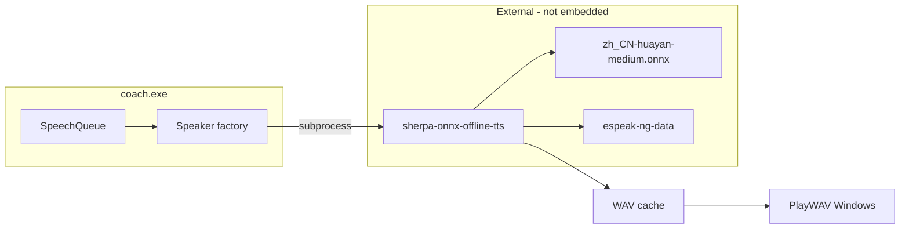

# feat: Sherpa-ONNX TTS 迁移（替代 Piper CLI）

## Summary

将 `iracing-coach` 默认 TTS 从已不可维护的 Piper 预编译二进制，迁移为 **Sherpa-ONNX 离线 CLI + Piper 兼容中文 medium 模型** 的外部依赖模式。保持 `Speaker` 接口与子进程隔离；提供 PowerShell 一键安装脚本；可选 Windows SAPI 应急降级。不把模型嵌入 `coach.exe`。

## Problem Frame

见 origin `docs/brainstorms/2026-06-09-iracing-coach-tts-engine-requirements.md`。Piper 继任仓库为 Python-only；用户优先级为 **中文自然度 > 安装简单 > 首句延迟**。本计划解决 HOW：配置字段、Sherpa 调用约定、安装脚本、弃用 Piper 路径。

---

## Requirements

| ID | 要求（实现后必须为真） |
|----|------------------------|
| T1 | 默认 `tts_engine=sherpa`，子进程合成，coach 进程不加载 ONNX |
| T2 | 配置含 `tts_bin`、`tts_model`、`tts_data_dir`；启动校验缺失时给出可操作错误 |
| T3 | 默认中文 **medium** 神经模型（自然度优先） |
| T4 | `Speaker.Cancel()` 与 WAV 缓存行为与现队列兼容 |
| T5 | PowerShell 脚本可下载并配置 Sherpa + 模型 + espeak-ng-data |
| T6 | README/示例配置不再指向 archived Piper 作为首选 |
| T7 | 可选 `tts_engine=sapi` 降级，非默认 |
| R12 | 圈末 p90 开播仍 ≤10s（标准赛道）；不达标再议 Sidecar |

---

## Key Technical Decisions

**KTD-T1: 引擎 = Sherpa `sherpa-onnx-offline-tts` CLI**  
对照 [k2-fsa/sherpa-onnx releases](https://github.com/k2-fsa/sherpa-onnx/releases) Windows x64 预编译包。Rationale: 活跃维护、CPU ONNX、复用 Piper 系模型，与现有 subprocess+WAV 架构一致。

**KTD-T2: 默认模型 `vits-piper-zh_CN-huayan-medium`**  
自 HuggingFace `csukuangfj/vits-piper-zh_CN-huayan-medium`（及 `tokens.txt`、espeak 数据）。Rationale: 用户优先级 1=自然度；x_low 仅作高级用户可选。

**KTD-T3: 资产目录 `%LocalAppData%/iracing-coach/tts/`**  
安装脚本与 coach 默认在此查找 `bin/`、`models/`、`espeak-ng-data/`。Rationale: 不污染 PATH、UI 一键安装目标明确。

**KTD-T4: 配置字段迁移**  
新增 `tts_engine`, `tts_bin`, `tts_model`, `tts_data_dir`。`piper_bin`/`piper_model` 读取时映射到 sherpa 路径并打 deprecation 日志，v1.2 删除。Rationale: 语义清晰，避免继续绑定 Piper 品牌。

**KTD-T5: 工厂 `tts.NewSpeaker(cfg)`**  
`run.go` 不再直接 `NewPiperSpeaker`。Rationale: 多引擎扩展点（sherpa / sapi）。

**KTD-T6: 不实现 Sidecar**  
本计划范围外；记入 Deferred。Rationale: 延迟优先级第三。

**KTD-T7: 移除 go:embed Piper 捆绑**  
若存在 `bundled.go` / `fetch-bundled-assets.ps1` 的 embed 方案，本迁移删除。Rationale: 与 T10（不外嵌模型）一致。

---

## High-Level Design



**合成时序（不变）**

1. 模板渲染文本 → `SpeechQueue`  
2. `Speaker.Speak` → 查 WAV 缓存 → 若无则 `sherpa-onnx-offline-tts` 写 WAV  
3. `PlayWAV` 播放；新圈 `Cancel()` 中断

---

## Output Structure

```text
iracing-coach/
├── scripts/
│   └── install-tts.ps1          # 下载 Sherpa + medium 模型 + espeak data
├── internal/
│   ├── config/config.go         # tts_* 字段 + Validate
│   └── tts/
│       ├── speaker.go           # NewSpeaker factory
│       ├── sherpa.go            # SherpaSpeaker
│       ├── sapi_windows.go      # 可选 SAPI 降级
│       ├── piper.go             # 删除或 deprecated stub
│       ├── play_windows.go
│       └── sherpa_test.go
├── coach.yaml.example
└── README.md
```

---

## Implementation Units

### U1. 配置与 Speaker 工厂

**Goal:** `tts_*` 配置、校验、引擎工厂。  
**Requirements:** T2, T4, KTD-T4, KTD-T5。  
**Dependencies:** 无。  
**Files:** `internal/config/config.go`, `internal/config/config_test.go`, `internal/tts/speaker.go`  
**Approach:** `tts_engine` 枚举 `sherpa`|`sapi`；默认 `sherpa`；`DefaultTTSPaths()` 指向 `%LocalAppData%/iracing-coach/tts/`；`piper_*` 兼容映射。  
**Test scenarios:**
- Happy: 合法 sherpa 路径通过 Validate  
- Edge: 仅旧 `piper_bin` 字段仍可加载  
- Error: sherpa 引擎但缺 `tts_model` → 明确错误  
**Verification:** `go test ./internal/config/...`

---

### U2. SherpaSpeaker 实现

**Goal:** 子进程调用 Sherpa CLI 合成 WAV，保留缓存与 Cancel。  
**Requirements:** T1, T3, T4, R12。  
**Dependencies:** U1。  
**Files:** `internal/tts/sherpa.go`, `internal/tts/sherpa_test.go`, `cmd/coach/run.go`  
**Approach:** 对照 release 附带的 `sherpa-onnx-offline-tts` 示例命令行（实现时读 upstream 文档固定参数）；`hash(text+model)` 缓存；`exec.CommandContext` + `Cancel`。  
**Execution note:** 实现前用安装脚本在本机跑一次 CLI，把实测命令记入代码注释或测试 fixture。  
**Test scenarios:**
- Happy: mock `tts_bin` 脚本写固定 wav → Play 被调用  
- Error: CLI 非零退出 → 返回 wrapped error  
- Edge: 空文本跳过  
- Edge: Cancel 中断阻塞中的 CLI  
**Verification:** 单元测试通过；本机试播中文句 <3s 合成（medium 模型）。

---

### U3. 安装脚本 `install-tts.ps1`

**Goal:** 一键下载默认 TTS 资产并生成 `coach.yaml` 片段或 `tts.paths.yaml`。  
**Requirements:** T5, T6, KTD-T2, KTD-T3。  
**Dependencies:** 无（可与 U2 并行）。  
**Files:** `scripts/install-tts.ps1`, `coach.yaml.example`  
**Approach:** 下载固定版本 Sherpa win x64 zip、huayan-medium onnx+tokens、espeak-ng-data；解压到 `%LocalAppData%/iracing-coach/tts/`；打印或合并配置。  
**Test scenarios:**
- Happy: 脚本在干净目录执行后 `Test-Path` 三件套为真  
- Error: 网络失败 → 非零退出与明确消息  
**Verification:** 手动在 Windows 跑脚本后 `coach.exe` 启动无 TTS 校验错误。

---

### U4. SAPI 降级（可选）

**Goal:** `tts_engine=sapi` 时使用系统语音。  
**Requirements:** T7, F-TTS3。  
**Dependencies:** U1。  
**Files:** `internal/tts/sapi_windows.go`, `internal/tts/sapi_windows_test.go`  
**Approach:** PowerShell `System.Speech.Synthesis` 或 win32 SAPI；仅 Windows build tag。  
**Test scenarios:**
- Happy: mock 或 skip if no zh voice  
- Edge: 无中文包 → 错误提示安装语音包  
**Verification:** 配置 `tts_engine: sapi` 可出声（质量预期较低）。

---

### U5. 清理 Piper 与文档

**Goal:** 移除误导性 Piper 依赖说明与死代码。  
**Requirements:** T6, KTD-T7。  
**Dependencies:** U2。  
**Files:** 删除 `internal/tts/piper.go`；更新 `README.md`, `cmd/coach/main.go` help, `coach.yaml`  
**Approach:** README 安装节改为「先运行 `scripts/install-tts.ps1`」；原 plan U6 描述在 README 注明已被本迁移取代。  
**Verification:** `grep -r piper_bin` 仅剩 deprecation 测试或 CHANGELOG。

---

### U6. 集成验证

**Goal:** 端到端圈末播报仍工作，满足 AE-TTS1–3。  
**Requirements:** R12, AE-TTS2, AE-TTS3。  
**Dependencies:** U2, U3。  
**Files:** `cmd/coach/run.go`（确认 `NewSpeaker` 接线）  
**Approach:** mock SDK 或 iRacing 练习 1 圈；日志含 `lap analyzed` 与合成延迟 ms。  
**Verification:** 手动验收 + 可选 `go test` mock speaker 集成测试。

---

## Scope Boundaries

**Deferred**

- TTS Sidecar 常驻服务  
- 设置 UI 图形化一键安装（脚本先行）  
- macOS/Linux TTS  
- 多模型商店

**Outside**

- 云 TTS 默认化  
- 嵌入模型进 coach.exe

---

## Risks & Dependencies

| 风险 | 缓解 |
|------|------|
| Sherpa CLI 参数随版本变化 | 锁定 release 版本于 install 脚本；注释记录实测命令 |
| medium 模型仍超 R12 | WAV 缓存；后续 Sidecar |
| espeak-ng-data 路径错误 | 安装脚本写绝对路径到配置；Validate 检查目录存在 |
| 用户无中文 SAPI 包 | SAPI 仅可选；默认不走 |

**Prerequisites:** Windows 10+、网络（仅安装时）、Go 1.22+。

---

## Open Questions

**Deferred to Implementation**

- Sherpa CLI 确切参数名（`--tokens`、`--data-dir` 等）以锁定版本的 `--help` 为准  
- `PlayWAV` 是否从 PowerShell `PlaySync` 换为带超时的 API（审查项 REL-02，可本计划一并修）

**Resolved in Planning**

- 默认引擎：Sherpa CLI（KTD-T1）  
- 默认模型：huayan-medium（KTD-T2）  
- 不外嵌 exe（KTD-T7）  
- 优先级：自然度 > 安装 > 延迟（origin）

---

## Suggested Implementation Order

```text
U1 → U3 → U2 → U5 → U4 → U6
```

先脚本可安装资产，再接 SherpaSpeaker；SAPI 可最后。

---

## Sources

- Origin: `docs/brainstorms/2026-06-09-iracing-coach-tts-engine-requirements.md`  
- Prior plan U6: `docs/plans/2026-06-09-001-feat-iracing-lap-coach-plan.md`（由本计划 supersede TTS 部分）  
- Sherpa: https://github.com/k2-fsa/sherpa-onnx  
- Piper 继任: https://github.com/OHF-Voice/piper1-gpl
