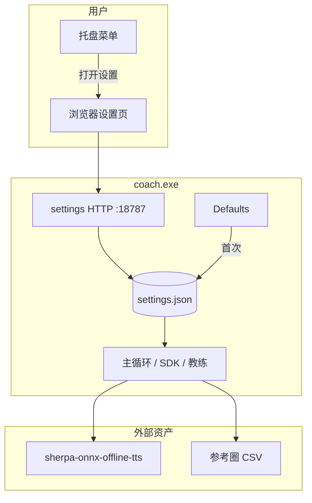

# feat: 设置 UI + Sherpa TTS（去掉 YAML 配置）

## Summary

用户不再编辑 `coach.yaml`。所有可调项通过 **本地设置 UI** 管理；运行时从 `%LocalAppData%/iracing-coach/settings.json` 读取（程序自动写入，非面向用户的手写配置）。**首次启动**使用内置默认值，仅引导用户完成两件必做项：选择参考圈 CSV、一键安装 TTS（Sherpa + 中文 medium 模型）。`coach.exe` 默认后台常驻采集；设置页通过托盘菜单或 `--settings` 打开。

## Problem Frame

当前实现依赖 `coach.yaml` 与 `piper_*` 路径，用户需手动编辑 YAML，且 Piper 预编译包已不可用（见 origin TTS requirements）。用户要求：**去掉配置文件、全部用 UI 设置、初始项用默认值**。本计划合并 TTS 迁移（Sherpa）与设置体验重构，替代 `2026-06-09-002` 中以 YAML/脚本为主的方案。

---

## Requirements

| ID | 要求（实现后必须为真） |
|----|------------------------|
| UI1 | 不存在用户必须维护的 `coach.yaml`；`coach.exe --config` 不再为常规路径 |
| UI2 | 所有可调设置可在设置 UI 中查看与修改 |
| UI3 | 首次启动：未初始化时应用 **代码内置 Defaults**，仅阻塞「参考圈 CSV」与「TTS 就绪」两项 |
| UI4 | 设置持久化为 `settings.json`（AppData），由程序读写；损坏时可重置为默认 |
| UI5 | 设置 UI 提供「安装语音引擎」一键下载（Sherpa + huayan-medium + espeak-ng-data） |
| UI6 | 托盘图标：打开设置、退出；教练在设置就绪后自动运行 |
| T1–T4 | 同原 Sherpa 计划：子进程合成、medium 中文模型、Cancel、WAV 缓存 |
| T5 | 参考圈通过 UI 文件选择器指定，保存绝对路径 |
| R11–R12 | 仍遵守本地 CPU TTS 与圈末延迟目标 |

---

## Key Technical Decisions

**KTD-UI1: 持久化 = JSON SettingsStore，非 YAML**  
路径 `%LocalAppData%/iracing-coach/settings.json`。Rationale: 用户不碰文件；仍须跨会话保存，JSON 便于 UI 与 Go struct 双向绑定。

**KTD-UI2: 设置 UI = 本机 HTTP + 内嵌静态页**  
`coach.exe` 在 `127.0.0.1:固定端口`（如 18787）提供设置 API 与单页 UI；`--settings` 或托盘项用 `start http://127.0.0.1:18787` 打开浏览器。Rationale: 无 Electron/Wails 重量；Go 单二进制；比 Win32 表单开发快。端口仅绑定 loopback。

**KTD-UI3: Defaults 在代码中定义**  
`internal/settings/defaults.go`：`language=zh`、`sdk_poll_hz=60`、`max_line_speech_sec=20`、`tts_engine=sherpa`、TTS 资产默认目录、`deep_explain_enabled=false` 等。首次无 `settings.json` 时等价于 Defaults + `initialized=false`。

**KTD-UI4: 就绪门控 ReadyGate**  
教练主循环仅在 `reference_csv` 有效且 TTS 校验通过时启动；否则托盘提示「打开设置完成初始配置」。不在 CLI 打印 YAML 路径错误。

**KTD-UI5: TTS = Sherpa CLI（同 002 计划）**  
资产目录 `%LocalAppData%/iracing-coach/tts/`；UI「安装语音」调用与 `install-tts` 相同逻辑（可保留 PowerShell 作 CI 备用，非用户主路径）。

**KTD-UI6: 高级项折叠**  
云端 LLM、SDK 采样率、无效圈阈值等放在设置页「高级」区，默认折叠，初值用 Defaults。

**KTD-UI7: 移除 gopkg.in/yaml.v3 依赖**  
`internal/config` 重构为 `internal/settings`（Store + Validate + Defaults）。

---

## High-Level Technical Design



**首次启动时序**

1. 启动 `coach.exe` → 加载 Store，无文件则 `Defaults`  
2. 注册托盘；若未就绪 → 气泡提示「请完成设置」并可选自动打开设置页  
3. 用户在 UI 选择参考圈 CSV → 点击「安装语音引擎」→ 进度条 → 保存 Store  
4. `ReadyGate` 通过 → 主循环与圈末教练开始

---

## Output Structure

```text
iracing-coach/
├── cmd/coach/main.go              # 去掉 --config；--settings；托盘启动
├── internal/
│   ├── settings/
│   │   ├── defaults.go
│   │   ├── store.go               # JSON load/save
│   │   ├── validate.go
│   │   └── store_test.go
│   ├── ui/
│   │   ├── server.go              # HTTP API + 静态资源 embed
│   │   ├── handlers.go            # 保存设置、安装 TTS、试播
│   │   └── static/                # index.html, app.js, style.css
│   ├── tray/tray_windows.go
│   └── tts/
│       ├── speaker.go
│       ├── sherpa.go
│       ├── install.go             # 下载逻辑（UI 与测试共用）
│       └── play_windows.go
├── assets/                        # 可选：设置页静态资源 embed 源
└── README.md                      # 无 coach.yaml 说明
```

删除：`coach.yaml`、`coach.yaml.example`、`internal/config` 的 YAML Load。

---

## Implementation Units

### U1. Settings 模型、Defaults 与 JSON Store

**Goal:** 替代 YAML `config` 包。  
**Requirements:** UI1, UI3, UI4, KTD-UI3, KTD-UI7。  
**Dependencies:** 无。  
**Files:** `internal/settings/defaults.go`, `internal/settings/store.go`, `internal/settings/validate.go`, `internal/settings/store_test.go`  
**Approach:** `Settings` struct 含参考圈、TTS 路径、语言、云端、高级数值；`Default()` 返回出厂默认；`LoadOrDefault()` / `Save()`；`Validate()` 区分「可保存」与「可开跑」。  
**Test scenarios:**
- Happy: 无文件时 LoadOrDefault 等于 Defaults  
- Happy:  round-trip Save/Load  
- Edge: 损坏 JSON → 错误 + 可 ResetDefaults  
- Error: reference_csv 空时 ValidateForRun 失败  
**Verification:** `go test ./internal/settings/...`

---

### U2. 设置 HTTP UI 与 API

**Goal:** 浏览器内完成全部设置。  
**Requirements:** UI2, UI5, T5, KTD-UI2。  
**Dependencies:** U1。  
**Files:** `internal/ui/server.go`, `internal/ui/handlers.go`, `internal/ui/static/*`  
**Approach:** REST：`GET/PUT /api/settings`；`POST /api/tts/install`（进度 SSE 或轮询）；`POST /api/tts/test`；`POST /api/reference/browse` 返回路径（或客户端 file input + 上传路径）。页面分区：常规（参考圈、语言、试播）、语音引擎（安装状态、安装按钮）、高级（云端、SDK Hz）。  
**Test scenarios:**
- Happy: PUT settings 后磁盘 JSON 更新  
- Happy: install 端点 mock 下载器成功  
- Edge: 未安装 TTS 时试播返回 400 + 文案  
**Verification:** `httptest` API 测试；手动浏览器改设置并重启 coach 仍保留。

---

### U3. 托盘与启动入口

**Goal:** 无配置文件的后台常驻 + 打开设置。  
**Requirements:** UI6, KTD-UI4, KTD-UI2。  
**Dependencies:** U1, U2。  
**Files:** `internal/tray/tray_windows.go`, `cmd/coach/main.go`, `cmd/coach/run.go`  
**Approach:** `github.com/getlantern/systray` 或等价轻量库；菜单：打开设置、关于、退出；`--settings` 仅打开浏览器不阻塞；主进程：起 UI server goroutine + ReadyGate 后 `run(settings)`。  
**Test scenarios:**
- Test expectation: none — 托盘需手动验收；逻辑用 ReadyGate 单元测试  
**Verification:** Windows 托盘可见；退出干净释放 SDK。

---

### U4. Sherpa TTS 与 UI 安装逻辑

**Goal:** 默认神经中文 TTS，安装由 UI 触发。  
**Requirements:** T1–T4, UI5, KTD-UI5。  
**Dependencies:** U1。  
**Files:** `internal/tts/sherpa.go`, `internal/tts/speaker.go`, `internal/tts/install.go`, `internal/tts/sherpa_test.go`  
**Approach:** `install.go` 封装下载/解压/校验；成功后写 `settings.TTSBin` 等并 Save；`NewSpeaker(settings)` 工厂。删除 `piper.go`。  
**Execution note:** 实现前对锁定版 Sherpa release 跑一次 CLI，记录参数。  
**Test scenarios:**
- Happy: mock install 后 Validate TTS 通过  
- Happy: mock sherpa 写 wav → Play 调用  
- Edge: Cancel 中断合成  
**Verification:** UI 试播按钮可听到中文。

---

### U5. 移除 YAML 配置与文档

**Goal:** 用户路径零 YAML。  
**Requirements:** UI1, T6（原 Piper 清理合并）。  
**Dependencies:** U2, U3, U4。  
**Files:** 删除 `coach.yaml`, `coach.yaml.example`, `internal/config/*`；更新 `README.md`, `go.mod`  
**Approach:** README 改为「双击 coach.exe → 托盘 → 设置」；开发文档说明 `settings.json` 仅调试重置用。  
**Verification:** 仓库无 `coach.yaml`；`go build` 无 yaml 依赖。

---

### U6. 集成与首次运行验收

**Goal:** 新用户无配置文件完成首圈教练。  
**Requirements:** UI3, R12, AE-TTS1（改编为 UI 流程）。  
**Dependencies:** U3, U4, U5。  
**Files:** `cmd/coach/run.go`  
**Approach:** 清空 AppData 目录模拟新用户 → 设置页选 CSV + 安装 TTS → iRacing 练习一圈 → 听到播报。  
**Verification:** 手动验收清单通过；`go test ./...` 绿。

---

## Scope Boundaries

**Deferred**

- 独立 `coach-settings.exe`（与 coach 分进程）  
- Wails/原生 Win32 表单 UI（先用浏览器内嵌页）  
- TTS Sidecar 常驻  
- macOS/Linux  
- 设置页多语言 i18n（v1 设置页中文即可）

**Outside**

- 用户手写 YAML/JSON 配置工作流  
- 云 TTS 默认

---

## Risks & Dependencies

| 风险 | 缓解 |
|------|------|
| 浏览器设置页观感偏「开发者」 | v1 接受；后续可换 Wails |
| 端口 18787 冲突 | 启动失败时尝试 +1 或配置项（高级） |
| TTS 下载慢/失败 | UI 进度与重试；日志写 AppData |
| 托盘需 Windows 消息循环 | 文档注明；仅用 Windows build |

---

## Open Questions

**Deferred to Implementation**

- 设置静态页用原生 HTML 还是轻量框架（建议 v1 原生 + 少量 JS）  
- Sherpa CLI 锁定版本与参数（实现时 `--help` 为准）  
- `PlayWAV` 超时（可随 U4 一并修）

**Resolved in Planning**

- 不用 coach.yaml（用户明确要求）  
- 持久化用程序管理的 JSON（KTD-UI1）  
- UI 技术：loopback HTTP + 浏览器（KTD-UI2）  
- TTS：Sherpa medium 中文（KTD-UI5）  
- 原 002 计划 YAML/脚本主路径：**本计划取代**

---

## Suggested Implementation Order

```text
U1 → U4 → U2 → U3 → U5 → U6
```

先 Store/Defaults 与 TTS 安装内核，再做 UI 与托盘，最后删 YAML。

---

## Sources

- Origin: `docs/brainstorms/2026-06-09-iracing-coach-tts-engine-requirements.md`  
- Supersedes: `docs/plans/2026-06-09-002-feat-sherpa-tts-migration-plan.md`  
- Parent: `docs/plans/2026-06-09-001-feat-iracing-lap-coach-plan.md`（U1 配置方式变更）  
- Sherpa: https://github.com/k2-fsa/sherpa-onnx
