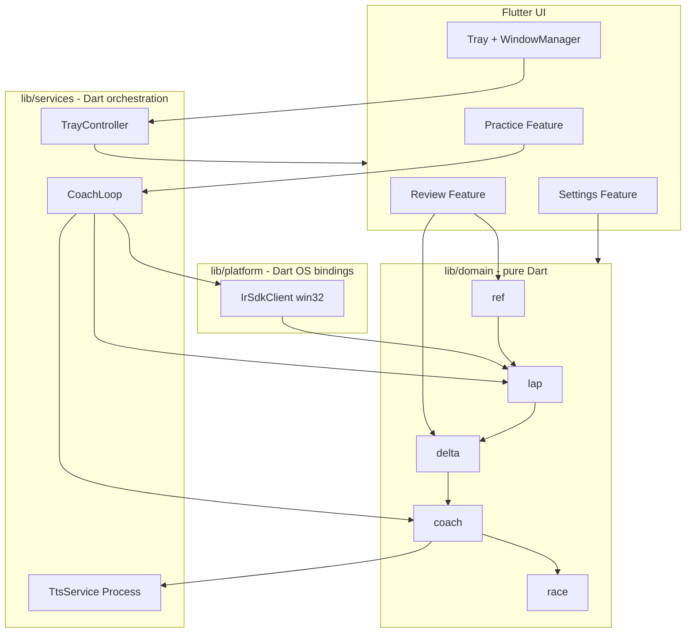
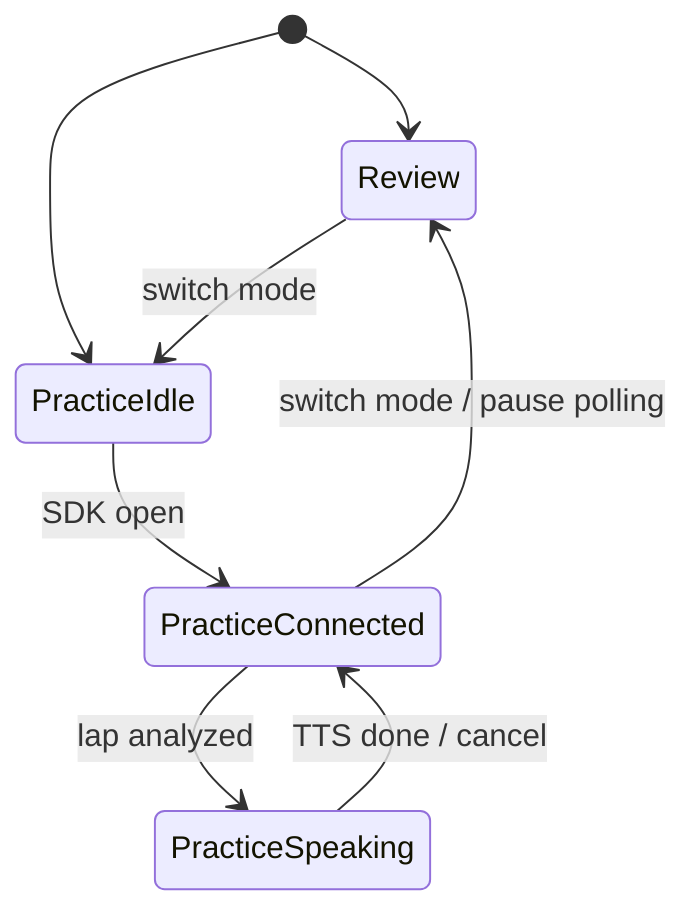

# feat: Flutter Desktop 纯 Dart 重写 iRacing 教练与本地 Analyze

## Summary

在仓库根目录新建 `iracing_coach/` Flutter Desktop（Windows）应用，**全量 Dart 重写**现有 `iracing-coach/` 全部业务能力：Garage 61 式离线 CSV 双圈分析、iRacing SDK 实时采集、圈末语音教练、Sherpa TTS、系统托盘与发布打包。**运行时零 Go 依赖**——不调用 `coach.exe`、不加载 Go 动态库、不用 FFI 桥接任何现有 Go 模块；`iracing-coach/` 仅作移植参照与 golden 对照，功能对等后归档。

## Problem Frame

现有 `iracing-coach/` 已实现 `delta.Analyze`、CSV 参考圈、规则教练与 Sherpa TTS，但**无可视化分析 UI**，复盘依赖 Garage 61 上传等待；设置 UI 为 loopback HTTP + 内嵌静态页（见 `docs/plans/2026-06-09-003-feat-settings-ui-sherpa-plan.md`），与「非 WebView 原生桌面体验」目标冲突。用户明确要求 **纯 Dart 单栈 + Flutter Desktop 单进程**，将分析、教练、设置统一为一个应用，并复用 `data/` 中 Garage 61 CSV 作为开发与验收样本。

---

## Requirements

| ID | 要求（实现后必须为真） |
|----|------------------------|
| R1 | Windows 单进程 Flutter 应用：系统托盘常驻、主窗口可最小化到托盘（点 X 默认隐藏到托盘，托盘菜单可退出） |
| R2 | 应用内两种模式：**复盘（Review）** 与 **练车（Practice）**；同一窗口切换，非两个独立 exe |
| R3 | **复盘模式**：支持导入多个 Garage 61 单圈 CSV；用户选定参考圈与对比圈；`ValidateTrackMatch` 失败时展示原因并禁止分析 |
| R4 | **复盘模式**：双圈 trace 叠加（速度、刹车、油门、转向至少四通道）；累计 delta 曲线；弯道分段表（入弯/顶点/出弯损失）；GPS 折线地图叠层（无 Lat/Lon 时隐藏地图并提示） |
| R5 | **复盘模式**：分析在 isolate 执行，UI 不阻塞；大文件解析显示加载状态 |
| R6 | **练车模式**：Dart 实现的 `IrSdkClient`（经 `package:win32` 调 Windows 共享内存）约 60Hz 轮询，圈完成触发 Dart `CoachLoop` 分析（行为对齐原 Go，但逻辑全在 Dart） |
| R7 | **练车模式**：圈末规则教练 + Sherpa 子进程 TTS + 语音队列打断；Race 追及段与可选云端 LLM 解释（对齐 origin R1–R15） |
| R8 | `settings.json` 路径与字段兼容 `%LocalAppData%/iracing-coach/settings.json`；`ReadyGate` 仅阻塞练车模式，复盘模式可跳过 TTS 安装 |
| R9 | 领域算法与 Go 版数值一致：`domain/` 包无 `flutter` 依赖，golden 测试对照 `iracing-coach/testdata/` 与 `data/` 样本 |
| R10 | 发布物为单一 Flutter 构建产物 + Dart 实现的安装/捆绑逻辑；**不再发布** `iracing-coach/coach.exe` |
| R11 | **运行时禁止**调用 `coach.exe`、Go c-shared/动态库、或任何 Go FFI 桥；SDK、教练循环、TTS、托盘、打包脚本均在 Dart/Flutter 内实现 |
| R12 | 共享内存读取使用 Dart 生态的 `package:win32`（Dart→Windows API），**不是**「FFI 接入现有 Go SDK 模块」 |

---

## Key Technical Decisions

**KTD-0: 全量 Dart 移植，零 Go 运行时**  
Rationale: 用户明确要求全量转 Dart，而非 FFI 接入现有 Go 的 SDK、语音教练、托盘或发布链路。所有业务能力在 `iracing_coach/` 内用 Dart 重写；Go 源码只读对照，不参与运行。

**KTD-1: 新建 `iracing_coach/` Flutter 工程，Go 模块标记为 legacy**  
Rationale: ~4k LOC 逐包移植到 Dart；`iracing-coach/` 不并行演进、不作为 sidecar、不编译进 Flutter 产物。

**KTD-2: 分层 `lib/domain/`（纯 Dart）+ `lib/platform/`（OS 绑定）+ `lib/features/`（UI）+ `lib/services/`（编排）**  
Rationale: 算法可 `dart test` 独立验证；UI 与 60Hz 轮询解耦；**platform 层是 Dart 调 Windows API，不是调 Go**。

**KTD-3: iRacing SDK = Dart 重写 `IrSdkClient`（`package:win32` 调 `OpenFileMapping`）**  
Rationale: 将 `internal/irsdk/client_windows.go` **算法与协议逻辑移植为 Dart 源码**；win32 仅是 Dart 访问 OS 的标准方式，与「FFI 接 Go」无关。须实现双缓冲与 `IRSDKDataValidEvent`（Go 版未做，Dart 版补齐）。

**KTD-4: 教练主循环 `CoachLoop` 全 Dart 实现；SDK 轮询在 worker isolate**  
Rationale: `services/coach_loop.dart` 移植 `cmd/coach/run.go` 编排（60Hz、圈末分析、入队播报），**不委托 Go**。轮询放 worker 避免 Flutter 3.35+ UI 线程卡顿（#175135）。

**KTD-5: TTS = Dart 重写安装器 + 子进程调度 + 播放（非 Go `internal/tts` 封装）**  
Rationale: `lib/services/tts/` 用 Dart 实现下载、校验、`Process.start` 调 `sherpa-onnx-offline-tts.exe`、WAV 缓存与 `just_audio` 播放——逻辑移植自 Go，但**不链接或调用 Go 代码**。模型仍不进主进程（`CONCEPTS.md` Speaker 约束）。

**KTD-6: 复盘可视化 = `fl_chart` + `flutter_map`**  
Rationale: 多图光标同步用顶层 `GestureDetector` + 共享 `highlightedPct`（`fl_chart` 无内置跨图 sync）；地图用 OSM 瓦片 + `PolylineLayer`，v1 不做赛道资产矢量底图。

**KTD-7: `ValidateTrackMatch` 严格移植 Go 修复后语义**  
Rationale: `docs/solutions/logic-errors/iracing-coach-track-fingerprint-mismatch.md` — CSV ref（coverage）vs SDK cand（米制）须同量纲比较；复盘双 CSV 须单独 golden 覆盖。

**KTD-8: 参考圈数据模型拆分**  
- `practiceReferencePath`（持久化，练车用）  
- `reviewSession`（会话级 ref + cand，不写回除非用户点「设为练习参考圈」）  
Rationale: 避免复盘临时选择意外覆盖练车参考圈（spec-flow Q3）。

**KTD-9: 模式切换时 Practice 暂停 SDK 轮询与 TTS**  
Rationale: 切到复盘时 `Cancel()` 当前播报、停止轮询；回练车时恢复。最小化到托盘时练车模式可继续后台轮询（对标原 Go 常驻行为）。

**KTD-10: v1 仅支持 Garage 61 单圈单文件 CSV**  
Rationale: 现有 `ref.LoadCSV` 将整文件当作一圈；MoTeC 多圈分割推迟，导入时检测并提示。

**KTD-11: 测试策略 — domain golden 优先，SDK 用 mock + 可选实机清单**  
Rationale: 移植期以 `engine_repo_test.go`、`lap_mock_test.go` 期望为权威；每条 `ValidateTrackMatch` 路径至少一条 cross-source 测试。

**KTD-12: 状态管理 `flutter_riverpod`**  
Rationale: 教练循环、设置、复盘会话多源状态；避免 InheritedWidget 扩散。

---

## High-Level Technical Design



**模式状态机（简化）**



**复盘数据流**

1. 用户选 CSV → `ref.loadCsv`（isolate）→ 圈列表元数据（文件名圈时、样本数、赛道指纹）  
2. 选 ref + cand → `ref.validateTrackMatch` → 失败则错误面板  
3. 通过 → `delta.analyze`（isolate）→ `CoachReport` + grids → UI 绑图  
4. 图表 hover 按 `LapDistPct` 联动 trace / delta / 弯道表 / 地图 marker

---

## Output Structure

```text
iracing_coach/
├── lib/
│   ├── main.dart
│   ├── app.dart
│   ├── core/           # settings, paths, logging
│   ├── domain/         # lap, ref, delta, coach, race, cloud
│   ├── platform/windows/irsdk/   # Dart IrSdkClient（win32，非 Go）
│   ├── services/                 # coach_loop, tts, tray（全 Dart）
│   └── features/
│       ├── review/
│       ├── practice/
│       ├── settings/
│       └── tray/                 # tray_manager 封装，非 Go systray
├── test/domain/        # golden tests
├── assets/icons/
├── pubspec.yaml
└── windows/
iracing-coach/          # legacy Go — 只读参照，U8 后归档
data/                   # 共享验收 CSV（不变）
```

---

## Implementation Units

### U1. Flutter 工程脚手架与 domain/lap

**Goal:** 可运行的 Windows 空壳应用 + `LapSample`/`LapSeries` 模型。

**Requirements:** R1（部分）, R9

**Dependencies:** 无

**Files:**
- `iracing_coach/pubspec.yaml`
- `iracing_coach/lib/main.dart`
- `iracing_coach/lib/app.dart`
- `iracing_coach/lib/domain/lap/series.dart`
- `iracing_coach/test/domain/lap/series_test.dart`

**Approach:** `flutter create --platforms=windows`；`domain` 禁止 import `flutter`。`LapSeries` 字段对齐 `internal/lap/series.go`。

**Patterns to follow:** `iracing-coach/internal/lap/series.go`

**Test scenarios:**
- 空序列 `trackLengthMeters` 返回 0
- 单样本与 5000 样本 `coveragePct` 边界
- `estimateLapTime` 与 Go 同输入同输出（从 Go 测试抄一组 fixture）

**Verification:** `dart test test/domain/lap` 通过；`flutter run -d windows` 启动空白窗口。

---

### U2. domain/ref + domain/delta + golden 测试

**Goal:** CSV 加载、圈时推导、`ValidateTrackMatch`、`delta.analyze` 与 Go 数值一致。

**Requirements:** R3, R7, R9

**Dependencies:** U1

**Files:**
- `iracing_coach/lib/domain/ref/csv.dart`
- `iracing_coach/lib/domain/ref/filename.dart`
- `iracing_coach/lib/domain/ref/laptime.dart`
- `iracing_coach/lib/domain/ref/track_match.dart`
- `iracing_coach/lib/domain/delta/engine.dart`
- `iracing_coach/test/domain/ref/csv_test.dart`
- `iracing_coach/test/domain/ref/track_match_test.dart`
- `iracing_coach/test/domain/delta/engine_test.dart`
- `iracing_coach/test/domain/delta/engine_repo_test.dart`
- `iracing_coach/test/fixtures/`（从 `iracing-coach/testdata/` 复制）

**Approach:** 1:1 移植 `ref` 与 `delta` 包；`engine_repo_test` 使用 `data/` 中 Arnar vs Huang CSV（路径解析向上查找 repo `data/`，对标 `internal/testutil/data.go`）。

**Execution note:** 先写 failing golden，再移植算法。

**Test scenarios:**
- `ref_lap.csv` / `cand_lap.csv` 加载列映射
- Garage 61 文件名解析 `MM.SS.mmm`
- GPS+速度积分圈时与文件名兜底优先级
- CSV ref + CSV cand `ValidateTrackMatch` 通过（Laguna Seca 样本）
- 故意改 cand 指纹 >0.5% 失败
- **Cross-source:** CSV ref（无 `LapTimeSec`）+ cand 有圈时走 coverage 路径
- `delta.analyze` 总 delta、弯数、Top 弯 delta 与 Go `engine_repo_test` 一致（容差 1e-6）

**Verification:** `dart test test/domain` 全绿；`data/` 三文件 repo 测试不 skip。

---

### U3. domain/coach + race + cloud

**Goal:** 规则引擎、模板渲染、Speech 队列逻辑、Race 追及、LLM 客户端。

**Requirements:** R7

**Dependencies:** U2

**Files:**
- `iracing_coach/lib/domain/coach/report.dart`
- `iracing_coach/lib/domain/coach/templates.dart`
- `iracing_coach/lib/domain/coach/speech_queue.dart`
- `iracing_coach/assets/templates/*.tmpl`（从 Go 复制）
- `iracing_coach/lib/domain/race/catchup.dart`
- `iracing_coach/lib/domain/cloud/client.dart`
- `iracing_coach/lib/domain/cloud/validate.dart`
- `iracing_coach/test/domain/coach/report_test.dart`
- `iracing_coach/test/domain/race/catchup_test.dart`
- `iracing_coach/test/domain/cloud/client_test.dart`

**Approach:** 模板用 Dart `String` 插值或轻量模板包；`SpeechQueue` 状态机对标 `internal/coach/queue.go`。

**Test scenarios:**
- Top-3 弯排序与 pattern 映射
- 模板数字与 `CoachReport` 一致
- 新圈入队取消当前播报
- Race 无前车跳过；有前车 pace 分支
- Cloud 响应含篡改数字时校验失败

**Verification:** `dart test test/domain/coach test/domain/race test/domain/cloud` 通过。

---

### U4. core/settings 与路径兼容

**Goal:** 读写 `settings.json`，`ReadyGate`，默认值与校验。

**Requirements:** R8

**Dependencies:** U1

**Files:**
- `iracing_coach/lib/core/settings/store.dart`
- `iracing_coach/lib/core/settings/defaults.dart`
- `iracing_coach/lib/core/settings/validate.dart`
- `iracing_coach/lib/core/paths.dart`
- `iracing_coach/test/core/settings/store_test.dart`

**Approach:** JSON 字段名与 Go `internal/settings` 一致；首次启动检测旧安装。

**Test scenarios:**
- 缺文件写入默认
- 损坏 JSON 回退默认并提示
- `ReadyGate`：无参考圈 / 无 TTS → false
- 仅配置参考圈、无 TTS → Review 可用、Practice 阻塞

**Verification:** 测试读写真实 temp 目录；与 Go `store_test.go` 用例对齐。

---

### U5. Review 模式 UI（Garage 61 式分析）

**Goal:** 复盘完整 UX：多 CSV 导入、选圈、trace/delta/弯道表/地图。

**Requirements:** R2, R3, R4, R5

**Dependencies:** U2, U4

**Files:**
- `iracing_coach/lib/features/review/review_page.dart`
- `iracing_coach/lib/features/review/csv_import.dart`
- `iracing_coach/lib/features/review/lap_picker.dart`
- `iracing_coach/lib/features/review/analysis_controller.dart`
- `iracing_coach/lib/widgets/trace_chart.dart`
- `iracing_coach/lib/widgets/delta_chart.dart`
- `iracing_coach/lib/widgets/corner_table.dart`
- `iracing_coach/lib/widgets/track_map.dart`
- `iracing_coach/test/features/review/analysis_controller_test.dart`

**Approach:** `file_picker` 多选；解析放 `Isolate.run`；`fl_chart` 四图 + 共享光标；`flutter_map` GPS 折线；弯道表点击高亮 `LapDistPct` 区间。

**Test scenarios:**
- 导入 `data/` 三圈显示列表与圈时
- 选 Arnar ref + Huang cand 分析成功
- 赛道 mismatch 显示错误、无图表
- 无 GPS 列隐藏地图
- 解析 >200ms 显示 loading（可用 fake delay 单测 controller 状态）

**Verification:** 手动：复盘模式完整走通三文件；自动：controller 状态机单测。

---

### U6. Dart 移植 IrSdk + LapBuffer + CoachLoop

**Goal:** **Dart 源码**实现 Windows 共享内存客户端、圈缓冲、练车主循环（零 Go 调用）。

**Requirements:** R6, R7, R9, R11, R12

**Dependencies:** U2, U3, U4

**Files:**
- `iracing_coach/lib/platform/windows/irsdk/client.dart`
- `iracing_coach/lib/platform/windows/irsdk/types.dart`
- `iracing_coach/lib/platform/windows/irsdk/lap_buffer.dart`
- `iracing_coach/lib/platform/windows/irsdk/csv_provider.dart`
- `iracing_coach/lib/services/coach_loop.dart`
- `iracing_coach/test/platform/irsdk/lap_buffer_test.dart`
- `iracing_coach/test/platform/irsdk/csv_provider_test.dart`
- `iracing_coach/test/services/coach_loop_test.dart`

**Approach:** 将 `client_windows.go` / `lapbuffer.go` / `run.go` **逐行移植为 Dart**；`win32` 仅用于 `OpenFileMapping` 等 Win32 API。**禁止** `DynamicLibrary.open` 加载 Go 产物或调用 `coach.exe`。`CsvProvider` 供无 iRacing 时调试。

**Test scenarios:**
- `LapBuffer` 圈切换与样本累积
- `CsvProvider` 回放 `data/` CSV 产生圈完成事件
- Mock client：connected/disconnected 状态流
- Skip：pit、短圈、样本不足、track mismatch 各一条

**Verification:** 单元测试无 iRacing 依赖；实机清单：连接 iRacing 后状态栏变绿、圈末日志有 delta。

---

### U7. Dart TTS 服务 + Practice 模式 UI

**Goal:** **Dart 重写** Sherpa 安装/合成/播放与练车界面；语音播报端到端（非 Go `internal/tts` 包装）。

**Requirements:** R7, R8, R11

**Dependencies:** U3, U6

**Files:**
- `iracing_coach/lib/services/tts/sherpa.dart`
- `iracing_coach/lib/services/tts/installer.dart`
- `iracing_coach/lib/services/tts/player.dart`
- `iracing_coach/lib/features/practice/practice_page.dart`
- `iracing_coach/lib/features/settings/setup_wizard.dart`
- `iracing_coach/lib/features/settings/tts_install_tile.dart`
- `iracing_coach/test/services/tts/sherpa_test.dart`

**Approach:** 子进程 PATH 注入；WAV SHA256 缓存；`SetupWizard` 对标原设置页首次引导。

**Test scenarios:**
- Mock sherpa exe 返回 0 生成 wav
- 合成失败展示重试
- `ReadyGate` 未过 Practice 页显示阻塞原因
- 圈末 enqueue → player play（mock player）

**Verification:** 实机：安装 TTS 后圈末中文播报；p90 开播 ≤10s（手动记时）。

---

### U8. Dart 托盘/窗口、Dart 打包脚本与 Go 归档

**Goal:** **Dart/Flutter 实现**托盘与窗口生命周期、Release 打包与资源捆绑；Go 仅文档归档。

**Requirements:** R1, R10, R11

**Dependencies:** U5, U7

**Files:**
- `iracing_coach/lib/services/tray/tray_controller.dart`
- `iracing_coach/lib/features/tray/tray_menu.dart`
- `iracing_coach/tool/bundle_release.dart`（Dart 打包：复制 Sherpa runtime、默认资源）
- `iracing_coach/windows/runner/main.cpp`（仅 Flutter 模板；如需 `RunOnSeparateThread`）
- `iracing_coach/README.md`
- `iracing-coach/README.md`（legacy 声明）
- 根 `README.md`

**Approach:** `tray_manager` + `window_manager`（**替代** Go `getlantern/systray`，非包装 Go 托盘）。`tool/bundle_release.dart` **替代**任何 Go 发布脚本。禁止在打包物中包含 `coach.exe`。

**Test scenarios:**
- 窗口 X → 隐藏，托盘仍在
- 托盘退出 → 进程结束
- 练车播报中退出 → 无僵尸 sherpa 进程（手动）

**Verification:** Release 构建在干净 Win10/11 安装运行；Go `coach.exe` 文档标明 deprecated。

---

## Scope Boundaries

### In scope（本计划）

- Windows Flutter Desktop 单进程全功能重写
- 复盘：Garage 61 CSV、五类 v1 可视化、多文件选圈
- 练车：SDK + 语音教练 + 设置向导
- `settings.json` 向后兼容

### Deferred for later

- macOS / Linux 桌面
- MoTeC 多圈单文件自动切分
- 弯道 T1/T2 命名、赛道矢量底图
- 分析结果导出/分享
- CSV 列手动映射 UI
- Review 模式 TTS 播报
- `TTSSidecar` 热模型
- Supervision 实时叠层

### Deferred to Follow-Up Work（仅实施顺序，均为 Dart 实现）

- **Wave 1（U1–U5）:** 复盘模式先行验收（仍无 Go 运行时）
- **Wave 2（U3、U6–U8）:** 练车、TTS、托盘、打包——**同一 Flutter 应用内 Dart 完成**，非后续「接入 Go」

### Explicit non-goals（禁止方案）

- Go FFI / c-shared / `DynamicLibrary` 加载 `iracing-coach` 产物
- 与 `coach.exe` 并存或 subprocess 委托教练逻辑
- 保留 Go HTTP 设置页或 WebView 壳
- 「先 Flutter UI + Go 后端」混合架构

### Outside this product's identity

- 上传数据到 Garage 61 或第三方云
- 替代 iRacing 内置 delta UI
- 纯 Dart 内嵌 ONNX 推理（违背 Speaker 进程外模型约束）

---

## Risks & Dependencies

| 风险 | 缓解 |
|------|------|
| Dart IrSdk 协议误读导致脏数据 | 双缓冲 + DataValidEvent；对照 vipoo/irsdk 与 Go 参照实现；CsvProvider 离线回归 |
| Flutter 3.35 线程合并卡顿 | SDK worker isolate；必要时 `RunOnSeparateThread` |
| 数值移植漂移 | golden 测试强制对齐 Go；容差仅浮点误差 |
| Sherpa DLL PATH 问题 | 子进程 env 注入；安装器集成测试 |
| 地图瓦片 OSM 403 | 配置 `userAgentPackageName` 或 Esri 备用瓦片 |
| 范围膨胀（全量一次交付） | Phase A/B 分阶段；U5 完成即可内部演示复盘 |

---

## Open Questions

| 问题 | 状态 |
|------|------|
| 全量 Dart vs Go FFI 桥接 | **已决：** 全量 Dart 移植；禁止运行时接 Go（R11） |
| win32 是否等于「接 Go」 | **已决：** 否；R12 仅 Dart→Windows API，SDK 逻辑在 Dart 源码内 |
| 旧 coach.exe 并存 | **已决：** Flutter 对等后退役（R10） |
| 复盘会话持久化 | **Deferred：** v1 不保存历史 |
| Flutter pin 版本 | **实施时决：** 以 stable 为准，多机验证 #169178 |

---

## Suggested Implementation Order

```text
U1 → U2 → U4 ─┬→ U5 (Phase A 复盘)
              └→ U3 → U6 → U7 → U8 (Phase B 练车 + 发布)
```

---

## Alternative Approaches Considered

| 方案 | 结论 |
|------|------|
| Flutter UI + Go FFI 保留 delta/irsdk/tts | **拒绝** — 用户要求全量 Dart，非接现有 Go |
| Go sidecar + Dart UI（localhost/IPC） | **拒绝** — 双进程、非单栈 |
| 仅复盘 Dart，练车继续 coach.exe | **拒绝** — R10/R11 要求单一 Flutter 产物 |
| 全量 Dart + `package:win32` 读共享内存 | **采纳** — OS 绑定不可避免，但 SDK **逻辑**在 Dart 内 |

---

## Sources & Research

- 现有实现：`iracing-coach/internal/{delta,ref,coach,irsdk,tts,settings}`
- 产品词汇：`CONCEPTS.md`
- 指纹回归：`docs/solutions/logic-errors/iracing-coach-track-fingerprint-mismatch.md`
- 原教练需求：`docs/brainstorms/2026-06-09-iracing-lap-coach-requirements.md`
- 被取代 UI 决策：`docs/plans/2026-06-09-003-feat-settings-ui-sherpa-plan.md`
- 验收数据：`data/Garage 61 - *.csv`
- 外部：vipoo/irsdk、Sherpa-ONNX TTS CLI、fl_chart、flutter_map、win32 package
