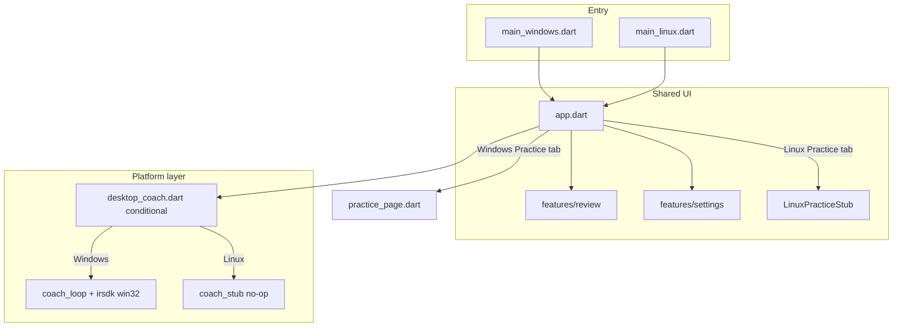

# feat: Linux 桌面复盘支持与 Cloud Agent UI 验证

## Summary

在 `irengineer/` 增加 **Linux 桌面构建**，交付与 Windows 同一套 Material 3 复盘 UI，使 Cursor Cloud Agent 能在 Linux（含虚拟显示）启动应用、手动走通黄金路径并截图验收。练车 Tab 保留为 **LinuxPracticeStub**；实时 SDK、Sherpa TTS、系统托盘最小化行为仅限 Windows。v1 通过 **AgentFixtureLoad**（环境变量 + 设置页维护者入口）绕过文件对话框，不强制 `integration_test`。

## Problem Frame

当前仅 `windows/` 平台可构建；`main.dart` → `coach_provider` → `coach_loop` → `platform/windows/irsdk` → `win32` 的导入链阻止 Linux 编译与运行。复盘 `domain/` 与 `features/review/` 已跨平台，阻塞在平台绑定与入口编排（见 origin R1–R5）。

**Actors:** A1 Cloud Agent / 维护者；A2 Windows 用户（行为不变）。

---

## Requirements Traceability

| ID | 要求 | 主要实现单元 |
|----|------|-------------|
| R1 | Linux Debug/Release 可构建 | U1, U2 |
| R2 | 复盘 UI 与 Windows 同结构 | U2（无复盘 UI 重写） |
| R3 | 练车 Tab = LinuxPracticeStub | U4 |
| R4 | 设置页 TTS/练车门控降级 | U5 |
| R5 | Linux 不依赖 win32/SDK 启动复盘 | U1, U3 |
| R6 | AgentFixtureLoad 确定性 CSV | U6 |
| R7 | `~/.config/irengineer/` 数据路径 | 已有 `paths.dart`，U8 文档确认 |
| R8 | Agent/Linux 运行文档 | U8 |

**Flows:** F1 黄金路径（U6+U8）；F2 导航抽检（U4+U5）；F3 Windows 回归（U3 条件编译隔离）。

**Success criteria（origin）：** Agent 完成 F1 且数值与 Windows 同样本一致；`flutter test` 在 Linux 通过；Linux 无 win32/SDK/TTS 子进程；README 有 Agent 小节。

---

## Key Technical Decisions

**KTD-P1: 条件导入隔离 Windows 教练栈，而非 `#ifdef` 复制业务逻辑**

`coach_loop`、`platform/windows/irsdk/*`、`services/tts/*` 仅经 `lib/platform/desktop_coach.dart` 条件导出：Windows 实现 / 非 Windows stub（no-op `pausePractice`/`startPractice`/`shutdown`）。`app.dart` 与 `review/*` 不直接 import `win32`。（见 origin KTD-1、R5）

**KTD-P2: 双入口 `main_windows.dart` / `main_linux.dart`**

`lib/main.dart` 仅 `export` 或按 `dart.io` 平台选择入口。Windows 保留托盘 + `setPreventClose`；Linux 使用 `window_manager` 普通窗口关闭，**不初始化托盘**（origin KTD-5、Deferred 托盘 parity）。

**KTD-P3: AgentFixtureLoad 双轨（采纳 origin 建议默认）**

- 环境变量 `IRENGINEER_FIXTURE_PATHS`：逗号分隔的 CSV 绝对路径；启动后自动 `importFiles`。
- 设置页 **维护者** 区块：「加载仓库样本」按钮，解析 `IRENGINEER_REPO_ROOT` 或向上查找含 `data/*.csv` 的目录。
- Agent 优先环境变量；手测用户仍可用 GTK 文件对话框。

**KTD-P4: Tab 切换保留复盘状态**

与 Windows 一致：切换练车/设置不清空 `reviewControllerProvider`（origin Outstanding Questions 默认）。

**KTD-P5: `win32` 保留在 pubspec，但 Linux 编译单元不得 import**

`client.dart` 仅被 Windows 实现文件引用；CI/Agent 以 `flutter build linux` 无链接错误为验收。

**KTD-P6: v1 不增 GitHub Actions `build linux` 阻塞项**

文档化本地/Cloud Agent 验证；可选 follow-up workflow（origin Deferred）。

---

## High-Level Technical Design



**Agent 黄金路径（F1）：**

```text
xvfb-run flutter run -d linux -d linux
  → 读取 IRENGINEER_FIXTURE_PATHS
  → reviewController.importFiles
  → 选 ref/cand → 分析
  → 目视：图表 + 弯道表 + 总 Δ
```

---

## Output Structure

```text
irengineer/
├── linux/                          # U2 flutter create
├── lib/
│   ├── main.dart                   # 平台入口转发
│   ├── main_windows.dart           # U3
│   ├── main_linux.dart             # U3
│   ├── core/platform/
│   │   └── desktop_capabilities.dart
│   ├── platform/
│   │   ├── desktop_coach.dart      # export 条件
│   │   ├── desktop_coach_stub.dart
│   │   ├── desktop_coach_windows.dart
│   │   └── windows/irsdk/          # 不变，仅 Windows 侧引用
│   ├── features/practice/
│   │   ├── practice_page.dart
│   │   └── linux_practice_stub_page.dart
│   └── features/settings/
│       └── agent_fixture_tile.dart
└── test/
    └── platform/desktop_coach_stub_test.dart
```

---

## Implementation Units

### U1. 桌面能力探测与教练栈条件导出

**Goal:** 定义 `supportsLiveCoaching`，建立 Windows/非 Windows 教练 API 边界，解除 Linux 对 `win32` 的编译依赖。

**Requirements:** R5

**Dependencies:** 无

**Files:**
- `irengineer/lib/core/platform/desktop_capabilities.dart`（新建）
- `irengineer/lib/platform/desktop_coach.dart`（新建，conditional export）
- `irengineer/lib/platform/desktop_coach_stub.dart`（新建）
- `irengineer/lib/platform/desktop_coach_windows.dart`（新建，转发 `coach_provider` 现有实现）
- `irengineer/lib/services/coach_provider.dart`（修改：仅 Windows 实现文件 import `coach_loop`）
- `irengineer/test/platform/desktop_coach_stub_test.dart`（新建）

**Approach:** Stub 提供 `CoachLoopNotifier` 等价接口：`startPractice`/`pausePractice`/`shutdown` 在 Linux 为 no-op 或返回固定 `lastStatus`；`coachLoopProvider` 通过条件导出注册。`desktop_capabilities.supportsLiveCoaching` 由 `Platform.isWindows` 驱动（运行时），编译期靠 conditional import 隔离 `client.dart`。

**Patterns to follow:** Dart 官方 conditional import 模式；现有 `IrSdkClient.open` 内 `Platform.isWindows` 守卫。

**Test scenarios:**
- Happy: stub `startPractice` 不抛错且 `connected` 恒 false
- Happy: stub `shutdown` 可重复调用
- Edge: 非 Windows 上 `pausePractice` 在复盘切换时可 await

**Verification:** `flutter analyze` 在 Linux 目标下无 `win32` 未定义错误；stub 单测绿。

---

### U2. 生成 Linux 平台工程

**Goal:** 添加 `linux/` Flutter 桌面宿主，使 `flutter build linux` 成功。

**Requirements:** R1

**Dependencies:** U1（先确保 analyze 通过，再 create）

**Files:**
- `irengineer/linux/**`（`flutter create --platforms=linux .` 生成）
- `irengineer/pubspec.yaml`（确认 `window_manager` 等 Linux 兼容）

**Approach:** 在 `irengineer/` 目录执行 platform 生成；不修改 GTK 模板除非链接失败。图标可暂用默认，后续再换 PNG。

**Test scenarios:**
- Happy: `flutter build linux --debug` 退出码 0

**Verification:** 构建产物 `build/linux/x64/debug/bundle/` 存在可执行文件。

---

### U3. 双入口与 `app.dart` 平台分支

**Goal:** Windows 保留托盘与教练生命周期；Linux 简化入口且共用 `IracingCoachApp`。

**Requirements:** R1, R3, R5

**Dependencies:** U1

**Files:**
- `irengineer/lib/main.dart`
- `irengineer/lib/main_windows.dart`（从现 `main.dart` 迁出）
- `irengineer/lib/main_linux.dart`（新建）
- `irengineer/lib/app.dart`

**Approach:** Linux `main`：`windowManager` 初始化、显示 1200×800、**不** `setPreventClose`、**不** `TrayController`。`app.dart` 的 `_pages` 在 Linux 将 `PracticePage` 换为 `LinuxPracticeStubPage`；`_onModeChanged` 在练车 index 不调用 `startPractice`（或 stub 已 no-op）。Windows 路径保持现逻辑。

**Patterns to follow:** 现 `main.dart` 托盘与 `CloseToTrayHandler` 仅留在 `main_windows.dart`。

**Test scenarios:**
- Integration（手动/Agent）: Linux 启动无托盘相关崩溃
- Integration: Windows 启动仍隐藏到托盘

**Verification:** 两平台 `flutter run` 均可进复盘 Tab。

---

### U4. LinuxPracticeStub 练车页

**Goal:** 练车 Tab 展示 Windows/iRacing 限制说明，不触发 SDK/TTS。

**Requirements:** R3, F2

**Dependencies:** U3

**Files:**
- `irengineer/lib/features/practice/linux_practice_stub_page.dart`（新建）
- `irengineer/lib/app.dart`（引用）

**Approach:** 静态说明 + 链到 README Agent 小节；无 `coachLoopProvider` 监听、无 `initState` 自动 `startPractice`。

**Test scenarios:**
- Happy: 页面含「仅 Windows」「iRacing」关键文案
- Error: 进入练车不产生 `CoachLoop` 实例（可通过 stub 状态或日志约定验证）

**Verification:** Agent F2 第一步通过截图。

---

### U5. 设置页 Linux 降级

**Goal:** TTS 安装与练车 ReadyGate 在 Linux 隐藏或禁用并说明。

**Requirements:** R4, F2

**Dependencies:** U1, U3

**Files:**
- `irengineer/lib/features/settings/settings_page.dart`
- `irengineer/lib/features/settings/tts_install_tile.dart`
- `irengineer/lib/features/settings/setup_wizard.dart`
- `irengineer/lib/core/settings/validate.dart`（`readyGate` 在 Linux 可对练车返回「平台不支持」）

**Approach:** `desktop_capabilities.supportsLiveCoaching` 为 false 时：隐藏 TTS 安装 tile / wizard 练车步骤；ReadyGate 卡片改为「Linux 仅支持复盘」。复盘不依赖 ReadyGate（已有 `review does not require ready gate` 测试）。

**Patterns to follow:** 现有 `readyGateProvider` / `ttsReadyGate` 用法。

**Test scenarios:**
- Happy: Linux 下 `readyGate` 对练车 `ready == false` 且原因可展示
- Happy: `ttsReadyGate` 在 Linux 不阻塞复盘入口
- Regression: Windows ReadyGate 行为不变

**Verification:** `test/core/settings/store_test.dart` 扩展或新增 `validate` 平台分支测试。

---

### U6. AgentFixtureLoad

**Goal:** Cloud Agent 无需文件对话框即可导入 `data/` 样本并完成分析。

**Requirements:** R6, F1, KTD-P3

**Dependencies:** U3

**Files:**
- `irengineer/lib/core/platform/agent_fixture.dart`（新建：解析 env、查找 repo `data/`）
- `irengineer/lib/features/settings/agent_fixture_tile.dart`（新建，可选 dev 按钮）
- `irengineer/lib/app.dart` 或 `main_linux.dart`（启动后 `WidgetsBinding` 回调触发 auto-import）
- `irengineer/test/core/platform/agent_fixture_test.dart`（新建）

**Approach:**
- `IRENGINEER_FIXTURE_PATHS=/abs/a.csv,/abs/b.csv` → 启动后 `reviewController.importFiles`
- `IRENGINEER_REPO_ROOT` 可选；缺省时从 `Platform.resolvedExecutable` 向上查找含 `data/Garage 61` CSV 的目录（与 `test/domain` golden 路径策略一致）
- 设置页 dev 区：「加载仓库样本」手动触发同一逻辑

**Test scenarios:**
- Happy: 单路径 env 解析为长度为 1 的列表
- Happy: 多路径逗号分隔、trim 空格
- Edge: env 未设置 → 不自动导入、不崩溃
- Edge: 路径不存在 → `ReviewPhase.error` 可读消息
- Integration: 给定 `data/` 中两份 CSV，auto-import 后 `canAnalyze == true`

**Verification:** Agent 设 env 后 F1 无需点击「导入 CSV」。

---

### U7. 复盘与领域回归测试（Linux 可跑）

**Goal:** 确保现有测试在 Linux CI/Agent 环境绿，覆盖复盘核心。

**Requirements:** R2, success criteria

**Dependencies:** U1–U6

**Files:**
- `irengineer/test/features/review/analysis_controller_test.dart`（如有需要补平台无关用例）
- `irengineer/test/domain/**`（运行验证，通常无需改）

**Approach:** 不新增强制 integration_test；依赖既有 controller/domain golden。新增 `agent_fixture_test` 与 stub 测试。

**Execution note:** 在 Linux 环境跑全量 `flutter test` 作为 U7 验收。

**Test scenarios:**
- Happy: `analysis_controller_test` 状态机用例全过
- Happy: `engine_repo_test` / `data/` golden delta 容差 1e-6

**Verification:** Linux 上 `flutter test` 退出码 0。

---

### U8. Agent/Linux 文档

**Goal:** 满足 R8；Agent 可按文档复现 F1/F2。

**Requirements:** R8, R7

**Dependencies:** U2, U6

**Files:**
- `irengineer/README.md`
- 根 `README.md`（可选一句链接）

**Approach:** 新增 **Cloud Agent / Linux 验证** 小节：
- apt 依赖概要（`clang`, `cmake`, `ninja-build`, `pkg-config`, `libgtk-3-dev` 等 Flutter 文档标准集）
- `xvfb-run flutter run -d linux` 或 `flutter run -d linux`（有显示时）
- 环境变量示例 `IRENGINEER_FIXTURE_PATHS`、`IRENGINEER_REPO_ROOT`
- 推荐样本：`data/Garage 61 - *.csv` 路径说明
- F1 检查清单：弯道表行数 > 0、总 Δ 显示、无 error banner
- 明确 Linux 不支持练车/TTS

**Test scenarios:**
- Test expectation: none — 文档单元；人工/Agent 按清单走通即验收

**Verification:** 另一名维护者或 Agent 仅读 README 可完成 F1。

---

## Suggested Implementation Order

```text
U1 → U2 → U3 → U4 → U5 → U6 → U7 → U8
```

U4/U5 可与 U6 并行；U7 在 U6 后；U8 最后或与 U6 并行。

---

## Scope Boundaries

### Deferred for later（origin 保留）

- Flutter Web 复盘、`integration_test` 黄金路径
- Linux 安装包 / Flatpak / AppImage
- macOS 桌面
- PR CI `build linux` 强制 job
- Linux 系统托盘

### Deferred to Follow-Up Work（计划内）

- GitHub Actions `ubuntu-latest` + `flutter build linux` 可选 workflow
- `integration_test` 与 Agent 手测双轨

### Outside this product's identity

- Linux 上 iRacing / 共享内存模拟
- 单独 Linux UI 皮肤

---

## Risks & Dependencies

| 风险 | 缓解 |
|------|------|
| conditional import 遗漏导致 Linux 仍拉入 `win32` | U1 后 `flutter build linux`；grep `win32` import |
| Cloud 无显示器 | 文档 `xvfb-run`；Agent 截图可选 |
| `file_picker` 在 Agent 手测仍需要时失败 | R6 AgentFixtureLoad 为主路径 |
| 地图瓦片 403 | 已有无 GPS/地图降级；分析不依赖地图 |
| Windows 回归 | U3 双入口隔离；Windows 全量手测清单 |

**Prerequisites:** Flutter stable with Linux desktop enabled；origin `data/` 样本 CSV。

---

## Open Questions

| 问题 | 计划默认 |
|------|----------|
| 托盘是否在 Linux 后续支持 | v1 不做 |
| AgentFixture 是否在 Release 构建暴露 dev 按钮 | 仅 Debug 或 `kDebugMode` 显示 dev tile；env 在 Release 仍可用供 Agent |
| PR CI linux job | Deferred |

---

## Sources & Research

- Origin: `docs/brainstorms/2026-06-10-linux-desktop-support-requirements.md`
- Concepts: `CONCEPTS.md` — LinuxPracticeStub, AgentFixtureLoad
- 既有复盘实现: `irengineer/lib/features/review/`, `irengineer/lib/domain/`
- 阻塞链: `irengineer/lib/main.dart`, `irengineer/lib/services/coach_loop.dart`, `irengineer/lib/platform/windows/irsdk/client.dart`
- 路径: `irengineer/lib/core/paths.dart`（`irengineer` 数据目录已就绪）
- 计划 Deferred: `docs/plans/2026-06-09-004-feat-flutter-dart-rewrite-plan.md`（macOS/Linux 桌面）
